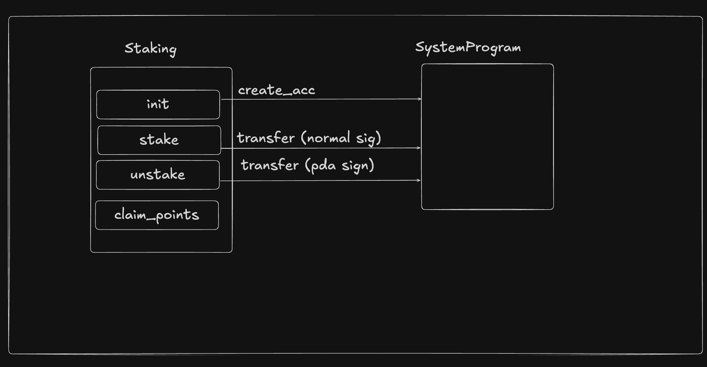

# What we’re building



people stake sol, we collect some points, when they take back sol, we give them that points also.

stake-> put the money on blockchain, let it be used, you get the interes{normal sign}

unstake-> pda se solana wallet me wapas bhejna pdega{need to do pda sign}

pda ka sol inc, don't call sign
but unstake-> need to sign the txn

# PDA in Solana

PDA is basically a account used to store the data
use cases:

- **Deterministic Account Addresses**: PDAs provide a mechanism to deterministically create an address using a combination of optional "seeds" (predefined inputs) and a specific program ID.
- **Enable Program Signing**: The Solana runtime enables programs to "sign" for PDAs which are derived from the program's address.

# PDA + CPI without anchor

write the contract and client

# Staking contract

Create a contract where users can come and stake (send) their SOL. You should calculate the `points` they have based on the time that has passed.

# PDA + CPI in anchor

Ref - 

## CPI without pdas

```rs
let cpi_context = CpiContext::new(
program_id,
Transfer {
from: from_pubkey,
to: to_pubkey,
},
)
.with_signer(signer_seeds);

    transfer(cpi_context, amount)?;
```

​

## CPIs with pda signing

```rs
let cpi_context = CpiContext::new(
program_id,
Transfer {
from: from_pubkey,
to: to_pubkey,
},
)
.with_signer(signer_seeds);

transfer(cpi_context, amount)?;
// or
let cpi_context = CpiContext::new_with_signer(
program_id,
system_program::Transfer {
from: from_pubkey,
to: to_pubkey,
},
signer,
);
transfer(cpi_context, amount)?;
```

update program id later in anchor contract
